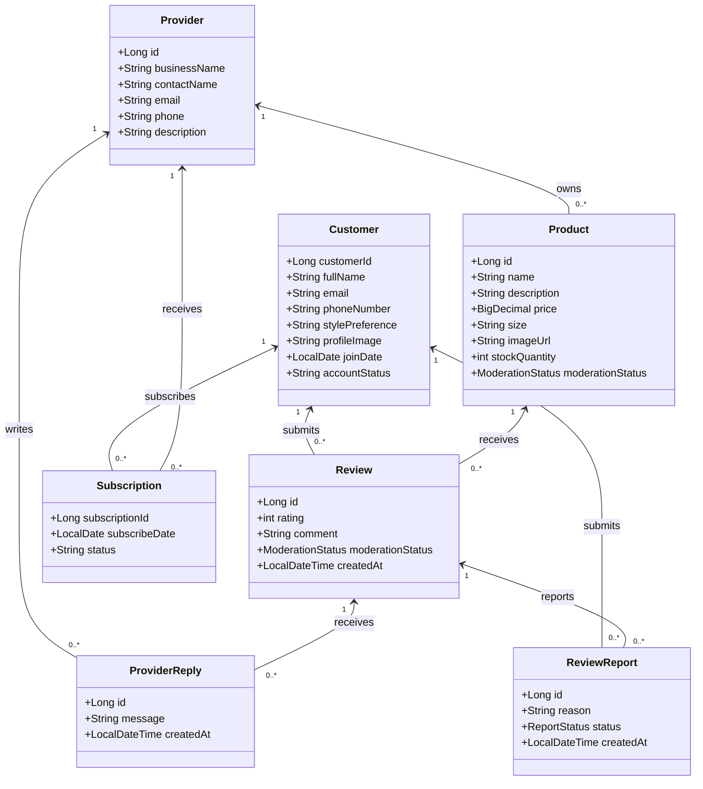

# FIT DI$TRICT — UML Class Diagram

## CSC 340 — Milestone 3 Backend API

```mermaid
classDiagram
    direction TB

    class Customer {
        +Long customerId
        +String fullName
        +String email
        +String phoneNumber
        +String stylePreference
        +String profileImage
        +LocalDate joinDate
        +String accountStatus
    }

    class Provider {
        +Long id
        +String businessName
        +String contactName
        +String email
        +String phone
        +String description
    }

    class Product {
        +Long id
        +String name
        +String description
        +BigDecimal price
        +String size
        +String imageUrl
        +int stockQuantity
        +ModerationStatus moderationStatus
    }

    class Review {
        +Long id
        +int rating
        +String comment
        +ModerationStatus moderationStatus
        +LocalDateTime createdAt
    }

    class ProviderReply {
        +Long id
        +String message
        +LocalDateTime createdAt
    }

    class ReviewReport {
        +Long id
        +String reason
        +ReportStatus status
        +LocalDateTime createdAt
    }

    class Subscription {
        +Long subscriptionId
        +LocalDate subscribeDate
        +String status
    }

    Provider "1" <-- "0..*" Product : owns
    Customer "1" <-- "0..*" Review : submits
    Product "1" <-- "0..*" Review : receives
    Provider "1" <-- "0..*" ProviderReply : writes
    Review "1" <-- "0..*" ProviderReply : receives
    Customer "1" <-- "0..*" ReviewReport : submits
    Review "1" <-- "0..*" ReviewReport : reports
    Customer "1" <-- "0..*" Subscription : subscribes
    Provider "1" <-- "0..*" Subscription : receives
```
